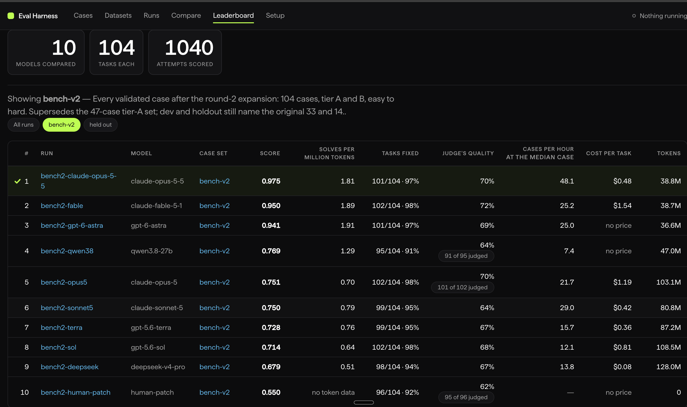
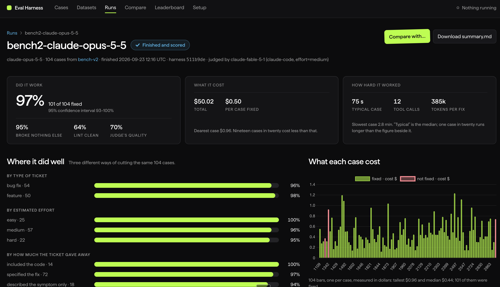
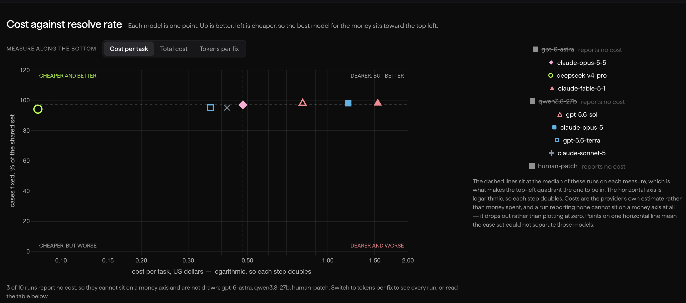

# ab-eval

**Benchmark AI models on your own codebase, using pull requests your team already merged.**

Public leaderboards measure somebody else's code. This measures yours: it mines merged pull
requests into tasks, hands each one to a model alone in a sandbox with no network, and passes
it only if the tests your engineers wrote for that change pass too.

You already have everything it needs. The tasks, the tests and the correct answers are sitting
in your git history.

```bash
git clone https://github.com/ABConvert/ab-eval.git
cd ab-eval
uv sync
uv run eval-harness init --repo ~/code/your-project
```

`init` reads the repository, writes `repos.yaml` and `models.yaml`, and tells you where you
stand — what it guessed, what to check, and anything still missing. The configuration is two
commented YAML files you can read, diff and review, and the dashboard's Setup page edits the
same two files: every save is validated by the harness's own loader, written atomically, and
backed up beside the original.

```bash
uv run eval-harness doctor                                  # re-check any time
uv run eval-harness import swebench --limit 5               # a real benchmark, right now
uv run eval-harness collect --repo your-project --dry-run   # or mine your own PRs
```

## Why bother, when SWE-bench exists

Because the answer moves. We tested nine coding configurations on 104 merged PRs. After a
post-hoc audit excluded eight cases whose reference patches failed in the test rig, five
configurations passed all 96 remaining cases. Their cost and speed still differed. The human
reference patch is a control on the test setup, not a competing model. This historical subset
is not a fresh run of the validation pipeline described below.

Neither of those conclusions transfers to your repository. Your language, your test
infrastructure, and above all how much your tickets give away — ours described the fix 69% of
the time, because the engineer who wrote the ticket usually implemented it — decide what a model
is actually being asked to do.

## Dashboard tour

These screenshots show the local dashboard using historical ABConvert `bench-v2` runs.
They illustrate the workflow, not a universal model ranking. The private tickets, source
patches and underlying run files are not included in this repository.

### Compare runs at a glance



The leaderboard brings completion, judge quality, token use, speed and estimated cost into
one view. Its composite score reflects the configured weights; the displayed "solves per
million tokens" metric is quality-weighted, not simply passed tasks divided by tokens.
The header's "10 models compared" includes nine coding configurations and one replay of the
merged human patches. That replay checks the test setup; it is not a competing model.

### Inspect a single run



Open a run to inspect its outcomes, estimated cost and median agent time, then break down
results by ticket type, estimated effort and how much guidance the ticket provided. The
per-case cost chart helps identify expensive attempts. This view reports cost **per case
fixed**, while the leaderboard reports cost **per attempted task**; the denominators differ.

### Explore cost versus completion



Each point represents a run. Up means more tasks passed; left means lower estimated cost
per attempted task on a logarithmic axis. Dashed lines mark the medians of the plotted runs.
Runs without a recorded dollar cost are omitted from this view, not treated as free. Switch
to total cost or tokens per fix to explore a different trade-off.

**How to read these historical screenshots:**

- The displayed pass rates use the original **104 cases**, including eight later excluded
  after the reference-patch audit. They are not the **96-case control-passing subset**
  discussed above; the UI's historical "validated" label does not establish that distinction.
- Dollar figures are recorded API-equivalent estimates, not subscription bills or total
  operating costs. Missing prices do not mean zero cost.
- Judge quality is separate from test pass/fail. The run shown uses Fable as its judge,
  which was also a contestant. Some rows have incomplete judging, as their badges indicate.
- The historical "broke nothing else" percentage is not an audited regression ranking.
  Suite errors and case exclusions need review before attributing it to model quality.
  Confidence intervals also do not establish reliability across repeated agent runs.

## How it works

```
init      read a repository → a first repos.yaml to correct
collect   merged PRs + their tickets → structural rules → curation → cases
validate  per case: build at the base commit, prove the tests fail first, then prove the
          team's own merged patch passes them; a case it cannot pass is invalid
run       per case: the model works through sandboxed tools → restore tests → run them
score     deterministic metrics + an optional LLM judge → summary.json
report    Markdown and JSON per run; compare gives head-to-head with paired intervals
```

A case is one merged pull request: the ticket as the prompt, the base commit as the starting
point, and the author's own tests as the grade. The reference patch is never shown to the model.
Test files are restored before grading, and an attempt that edited them is flagged.

**Validate before you run.** A case whose own reference patch fails its tests measures the
harness, not the model: a package missing from the sandbox, a suite that collects nothing, a
test that reads a file the case builder dropped. `validate` finds these, and `run` then records
such a case as invalid without calling the model, so it neither costs money nor counts as a
failure. On the benchmark this was built on, that check caught 8 broken cases in 104.

## The sandbox

Every tool call runs with `docker exec` inside a container created for that one attempt: no
network, no credentials, no bind mount of your working copy, dropped capabilities, and CPU,
memory and pid limits. Source arrives as a tar stream from `git archive`, so your checkout is
only ever read. See [SECURITY.md](SECURITY.md) for what that does and does not contain.

## Commands

```bash
eval-harness init --repo PATH [--key NAME] [--out FILE]
eval-harness doctor [--strict]
eval-harness collect --repo KEY --since YYYY-MM-DD --until YYYY-MM-DD [--dry-run] [--tiers A,B]
eval-harness validate [--case ID | --split NAME] [--concurrency N]
eval-harness run --model KEY [--case ID | --split NAME] [--max-turns N] [--wall-clock S]
                 [--max-output-tokens N] [--tool-timeout S]
eval-harness score --run ID [--no-judge] [--no-cache] [--judge-key KEY] [--write-as FILE]
eval-harness report --run ID
eval-harness compare --runs A --runs B [--runs C …]
eval-harness dataset list|show|create|add|remove --name NAME
eval-harness dashboard [--host 127.0.0.1] [--port 8765]
```

The dashboard is a local UI over the same files: cases and their validation state, live run
progress, per-run metrics, the judge's notes, head-to-head comparisons, a leaderboard, and a
Setup page that checks the machine and edits `repos.yaml` and `models.yaml`. It holds no state
of its own and never talks to a model. Setup refuses to store an API key (the files record the
*name* of the environment variable, never its value), and it only writes when the dashboard is
bound to loopback: `repos.yaml` holds shell commands the harness later runs, so a writable page
on a network interface would be remote code execution.

## Budgets and judges

A model's run budget can live in `models.yaml`, so a slow local model gets a longer clock than a
hosted API without editing every command; a flag passed to `run` overrides it for that run, and
the budget actually used is recorded in the run's summary.

```yaml
local-27b:
  provider: openai-compat
  model: qwen3.8-27b
  base_url: http://gpu-box:11434/v1
  api_key_env: LOCAL_LLM_API_KEY
  caps:
    wall_clock_seconds: 5400
```

Code quality is scored by an LLM judge — the `judge` entry in `models.yaml`. Pick one from a
lab with no model in the comparison: judges favour their own family. To compare two judges on
the same attempts, write the second one beside the first, and cap what a priced judge may spend:

```bash
export ABEVAL_SPEND_LEDGER=~/eval-data/judge-spend.jsonl  # every priced judge call is logged
export ABEVAL_SPEND_LIMIT_USD=20                          # no request is sent past this total
eval-harness score --run my-run --judge-key judge-b --write-as summary.judge-b.json
```

## Where your data lives

The harness is shared; your cases are not. `ABEVAL_DATA_ROOT` moves cases, datasets, curation,
results and the API cache together:

```bash
export ABEVAL_DATA_ROOT=~/eval-data      # defaults to the checkout
```

**Case files contain your source code** — the diff of each PR and its ticket text. If your
repository is private, so is your data root. Keep it in a separate, private repository.

## Supported today

| | |
|---|---|
| Test runners | `vitest`, `pytest`, `flutter` |
| Ticket sources | Linear (`linear_team` in repos.yaml); GitHub Issues where no key convention is found |
| Providers | `anthropic` (API key), `openai-compat` (any OpenAI-shaped endpoint, incl. local), `claude-code` and `codex-cli` (local subscription logins) |
| Judge | `claude-code` and `anthropic` |

Start with `anthropic` or `openai-compat` and an API key: the two CLI providers measure that
tool's agent loop as well as the model, and depend on a login on the machine.

Adding a runner or a provider is a contained change — see [CONTRIBUTING.md](CONTRIBUTING.md).

## Reading the numbers

- **Resolved** — the case's own tests pass with the test files restored. The primary metric.
- **No regression** — the package's full suite shows no failure outside the recorded baseline.
  Candidates are re-run alone, so load flakes do not count.
- **Code quality** — an LLM judge, on resolved cases only. It qualifies a result; it never gates
  one. If your judge is also a contestant, say so: in our run the top-scoring model was the judge.
- **Cost per solved task** and **tokens per solved task** — the second is the only cost signal
  every provider reports, since subscriptions and local weights return no dollar figure.
- **Caps** — `max_turns` and `wall_clock` are your settings. A model that ran out of turns was
  not necessarily outmatched, and the two failures look identical in a summary unless you check.
- **Intervals** — percentile bootstraps. Under ~50 cases they are wide enough that a few points
  is noise; `compare` prints a paired interval and says plainly whether it excludes zero.

## What it cannot measure

- **Diagnosis from a vague report**, if your tickets describe the fix. `spec_level_heuristic` is
  recorded per case so you can split results on it.
- **Work larger than a pull request.** Selection caps change size; "hard" is relative to that.
- **Review quality, follow-up bugs, or how a change reads to the next engineer** beyond what a
  judge sees in a diff.
- **How much steering a person had to do.** Attempts are single-shot with a fixed prompt.

## Licence

[Apache-2.0](LICENSE).
